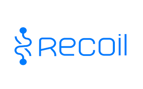

FE 개발자들이 개발을 하다보면서 사용하는 기술중 하나인 전역 상태 관리 하.. 그래서 그게 도대체 뭔데??
왜 FE 개발자들이 그걸 필요로 하는지 **너무** 궁금해서 조사해보았다.

## **📍상태**

**상태란 컴포넌트 내부에서 관리를 하며 어플리케이션의 렌더의 영향을 미치는 플레인 JavaScript Object이다.**

**( 변화하는 Data !! )**

**📚 Plain JavaScript ( Object )란?**

- 객체 리터럴{}을 이용해서 만들 수 있다.
- let 변수명={key:value, key2:value2, key3:value3, ...}형식으로 작성한다.
- 순서가 중요치 않은 데이터를 다룬다.
- 객체의 value에는 function 데이터 타입도 들어갈수 있다.

```
let mem={num:999, name:"이태랑", addr:"김경수"};

let car={
	name:"페라리",
	drive:function(){
	alert("개 빠름!");
	}
};
```

## **📍상태의 종류**

**📋 지역 상태 ( local state )**

지역 상태는 특정한 컴포넌트 내에서 관리하는 상태를 이야기한다.
다른 컴포넌트와 공유 ❌
예시로) Client에서 사용자가 login을 하기 위해서 input, textarea에 입력 등 ..

**📋 컴포넌트 간 상태 ( cross components state )**

컴포넌트 간 상태는 여러가지 컴포넌트에서 관리를 하는 사태를 이야기한다.
여러 컴포넌트에서 사용이 되기도 한다.
예시로) 내가 물건을 사기 위해 button을 클릭했을 때 그 다음으로 뜨는 모달
상위 컴포넌트에서 하위 컴포넌트로 props를 넘겨서 해당 컴포넌트로 전달이 되는 props dilling.

**📚 props dilling이란?**

props를 오로지 하위 컴포넌트로 전달하는 용도로만 쓰이는 컴포넌트를 거치면서 React Comoinnt트리의
한 부분에서 다른 부분으로 data를 전달하는 과정을 이야기 한다.

⭐️ **전역 상태 ( global state )** ⭐️

전역 상태는 프로젝트 전체의 영향을 끼치는 엄청난 상태인 놈이다.
이 또한 props dilling 방식을 활용해서 부모에서 자식으로 데이터를 전달한다.

## **📍상태관리 Tool**

**📢 Context API**

Context API는 React Components Tree 안에서 전역 상태를 공유를 할 수 있도록 만들어진 방법이다.
또 이미 존재하고 있는 상태를 다른 Components들과 쉽게 공유할 수 있게 해주는 역할을 해준다.


Context Api 대해서 더 공부를 해보고 싶다면?
아래의 블로그를 참고하면 좋을 것 같다 ⬇️⬇️

[Context AP에 대해서 더 알고 싶다면?](https://velog.io/@tnrud4685/TIL-context-API-%EB%9E%80)



## **📍전역 상태 관리의 종류**

전역 상태 관리의 기술은 엄청 나게 많은데 그 중에서 대표적으로 4가지 정도로 소개를 해볼까 한다.

**Redux | MobX | React-Query | Recoil**

### **⭐️ Redux**

먼저 Redux이다.
JavaScript 앱을 위한 예측이 가능한 상태 컨테이너 라이브러리이다.


Redux를 사용하는 이유중 하나는 props를 부모로 부터 먼 자식의 컴포넌트, 또는
자식에서 부모로 가는 컴포넌트로 props를 전달하다가 보면 data의 전달 방향이 매우 복잡해진다.
하지만 Redux를 사용하면 이러한 문제를 쉽고 간편하게 이해할 수 있다.

**Redux의 3가지 원칙으로는**

- 전체 상태값이 하나의 자바스크립트의 객체로 표현이 된다.
- 상태값은 읽기 전용의 불변 객체로 관리한다. 오직 수순함수에 의해서만 상태값을 변경해야 한다.

**🔥 순수 함수**

**함수에 어떠하나 인자가 주어질 경우 항상 값을 return하며 외부의 상태는 변화 ❌**

더 자세한 내용은 내 Tistory에 게시가 되어있다.

[Redux란 무엇일까?](https://ltr2006.tistory.com/9)

Redux Redux(리덕스)란? Redux(리덕스)란 JavaScript(자바스크립트) 상태관리 라이브러리이다. Redux(리덕스)의 본질은 Node.js 모듈이다. Redux의 기본 개념 3가지! 1. Single source of truth 동일한 데이터는 항상

### **⭐️ MobX**

MobX는 객체지향적인 느낌으로 프로그래밍을 한다.
Redux에 비해서 사용하는 방식이 더 간편하고 복잡하지가 않다는 장점이 있다.

**📢 MobX의 구성**


Action 함수가 실행이 되면 state 값이 변화를 해 rendering 같은 side effects들이 실행이 되어 결과가 보인다.
MobX에 대한 더 자세한 내용은 추후에 더 업로드 할 예정이다.

### **⭐️ React-Query**


React-Query는 React환경에서 비동기 Query 과정을 도와주는 라이브러리이다.
React Application에서 server 상태를 불러오고, 캐싱하며, 지속적으로 동기화하고 업데이트하는 작업을
도와주는 라이브러리, 복잡하고 장황한 코드가 필요한데 다른 값을 불러오기 방식과 달리 React Components
내부에서 간단하고 직관적인 API를 사용할 수 있다.
더 자세한 내용은 내 Tistory에 게시가 되어있다.
[React-Query를 왜 사용하는 것일까??](https://ltr2006.tistory.com/5)

react query란? react-query는 서버에서 가져온 데이터를 웹 브라우저 앱에서 사용하기 쉽게 도와주는 기술이다. 서버는 클라이언트에게 데이터베이스에 있는 정보를 전달해주는 역할을 하는데, 여기

### **⭐️ Recoil**



마지막으로는 Recoil이다.
Recoil은 페이스북에서 만든 새로운 React를 위한 상태 관리 라이브러리이다.
Recoil을 사용하면 atoms(공유 상태)에서 selectors (순수 함수)를 거쳐 React Component로 내려가는
data-flow graph를 만들 수 있다.

#### 간단하게 Recoil의 구성으로는

- ##### Atoms : 상태 단위로 data가 변경이 되면 구독한 컴포넌트는 다시 렌더링이 된다.
- ##### Selectors : Atoms나 다른 Selectors를 입력으로 받아들이는 순수 함수이다.

Recoil에 대한 더 자세한 내용은 추후에 더 업로드 할 예정이다.

    하
    하
    하

    진짜 개 어렵네 .. 내가 하면서 느낀 것이 너무나도 많은데 그 중에서 내가 사용을 해본 것은 React-Query이다.
    앞으로 프로젝트 경험을 하면서 더 많은 전역 상태 관리를 사용을 하고 실무에서도 적응을 해야하기 앞으로
    전역 상태 관리에 대해서 조금 더 깊게 학습을 해볼 필요가 있을 것 같다. 특히 Redux | Recoil RR 듀오로 간다.
