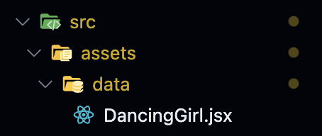

내가 해커톤을 진행하면서 blender에서 3D 캐릭터를 만들어서 vscode에서 사용을 해보려고 하였다.  
Three.js를 사용해서 gltf로 캐릭터를 나타내고 애니메이션을 구현하는 프로젝트를 구상하였다.  
하지만 생각보다 gltf 파일을 사용하는 방법이 매우 까다로웠는데, 그 블로그 하나로 깔끔하게 정리해보려고 한다.

#### **⭐️ pulbic에 gltf 파일을 추가한다.**


public 폴더 안에 gltf 파일을 추가를 한다.  
그러면 여기서는 내가 만든 3D 입체 모양의 모델링이 나온다.

#### **⭐️ gltf을 jsx(tsx) 파일로 변환을 시켜줘야 한다.**

파일의 경로를 ./public으로 한 상태에서 아래와 같은 명령어를 입력한다.

```
npx gltfjsx **.gltf
```

위와 같은 내용으로 명령어를 입력을 한다.
내용을 내가 작성한 파일명으로 작성을 하면 jsx 파일이 하나 생성이 된다.



위와 같이 jsx 파일이 생성이 된다.
그 다음으로 jsx로 가서 추가적으로 내가 이 모델링을 사용할 location과 size를 설정을 해주어야 하는데,
내가 처음으로 설정한 크기와 위치가 아닐 수도 있음으로 잘 봐야한다.

**나도 처음에 jsx파일을 import를 했는데 안 나와서 당황했지만 location을 바꾸니 바로 나오는 것을 볼 수 있었다.**

#### ⭐️ gltf 파일을 import 이후 return문 작성 ( 중요 )

gltf파일을 import해서 사용을 할 때 return의 logic도 매우 매우 중요한데, 아래와 같은 양식으로 해야 사용할 수 있다.

```
 return (
    <Canvas>
      <Physics>
        <DancingGirl />
      </Physics>
    </Canvas>
  );
```

내가 프로젝트를 진행하면서 gltf 파일을 import를 못 해서 진짜 많은 시간을 소비를 했는데 ..  
다른 개발자들이 내 블로그를 보고 한번에 해결할 수 있었으면 좋겠다!!

⭐️ [블로그 보러 보기](https://ltr2006.tistory.com/13)
